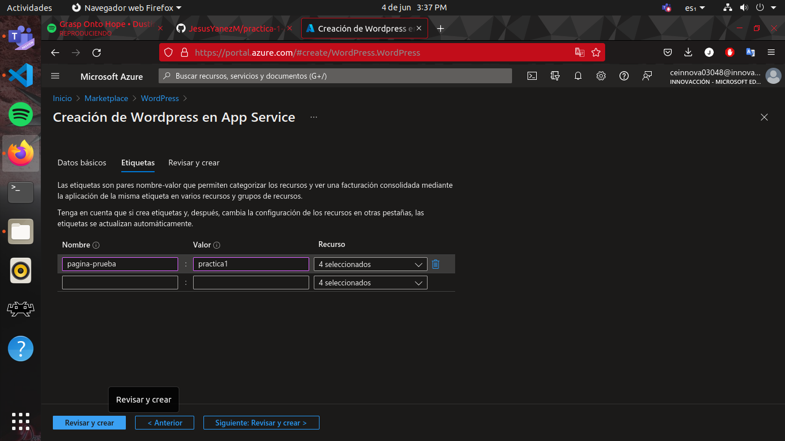

# Practica 1: Creación de un grupo de recursos en Azure

En esta practica veremos el metodo para crear un grupo de recursos en azure, tomando como ejemplo la implementacion de una pagina web de WordPress

**Requisitos**

-Tener acceso a una suscripcion y cuenta de Azure

**Procedimiento**

-Debemos acceder al [portal de Azure](portal.azure.com) 

-En la barra de busqueda escribiremos Marketplace y seleccionamos el icono de la bolsa azul con la nube blanca, ya dentro de este menu en su barra de busqueda escribiremos WordPress

-Seleccionaremos el primer icono que es de color gris y esta denominado como WordPress, una vez que nos habra su ventana presionaremos el boton [crear] para que se construya el recurso

-Se nos abrira la siguiente pantalla donde deberemos especificar las caracteristicas de nuestro pagina web 

-Recordemos que para crear cualquier recurso se necesita: **Una suscripcion, Grupo de recursos, Region y un Nombre**

**Nota:** En la seccion de etiquetas solo sirve para dar informacion extra del recurso, como por ejemplo definir la importancia o el area administrativa al que va dirigida

-Definido esto ahora si podremos precionar el boton de revisar y crear para que el sistema revise si hay alguna falla con el recurso, eso nos llevara auna pestaña en la que encontraremos todo lo que acabamos de especificar ademas de algunos apectos extras, esta pestaña tambien incluira un mensaje que comunicara si hay algun error o si ya es posible crear el recurso. Lo unico que resta, si todo sale bien, es presionar el boton de crear

-Listo, Azure nos redirigira a una ventana donde se muestra el recurso, sus opciones y configuraciones, ademas de todos los recursos que tubo que crear para que en este caso se construyera la pagina web

**Nota:** La creacion del recurso puede tardar unos segundos o algunos minutos

